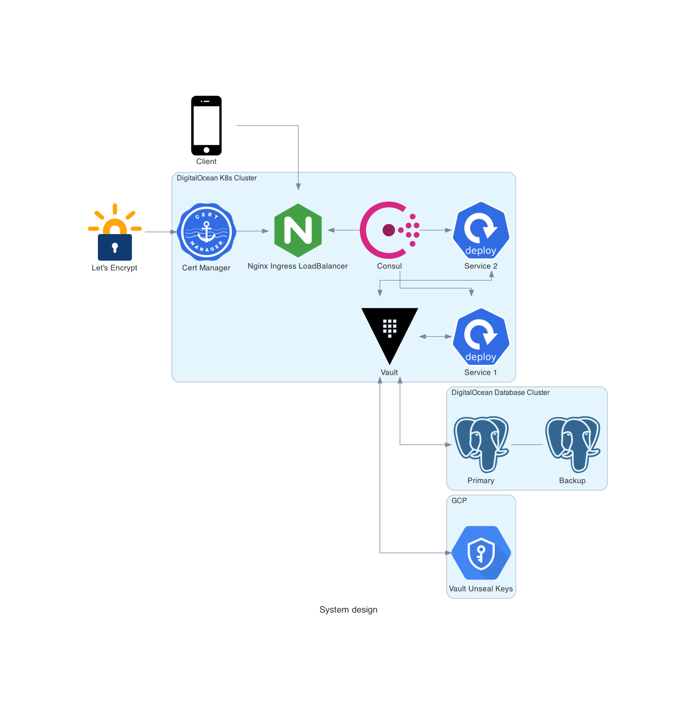

# Summary

`mono` contains source files for an iOS app that can fetch and display fundamental analysis reports for a given
security. It's currently under development and not ready for production deployment.

At a high level, the iOS app is built using standard tools like XCode and SwiftUI with the help of some libraries like
`SwiftProtobuf`, `RxSwift`, and `Moya`. The client sends and receives Protocol Buffers over HTTP to a server running on
a Kubernetes cluster.

Using `grpc-gateway`, the server listens to gRPC and HTTP requests on the same port and sometimes responds with a
Protocol Buffer. The rest of this document will dive deeper into how each part of this flow works and how to get started
hacking on each part of the stack.

## General setup

Every developer should install the following tools manually:

1. `brew`
1. `docker`
1. `pyenv`
1. `kubectl`
1. `minikube`
1. `bazelisk`
1. `ta-lib`
1. `virtualenv`

Start with the tools that won't be installed by a package manager: `brew` and `docker`. Instructions to install `brew`
can be found [here](https://brew.sh/). Instructions to install `docker` can be found [here](https://docs.docker.com/docker-for-mac/install/).

For context, `brew` will manage the required packages that will be installed later and the backend services run inside
containers, which is why `docker` must be installed among other reasons.

The next few tools can be installed with `brew` from the command line:

```bash
$ brew install pyenv
$ brew install kubectl
$ brew install minikube
$ brew install bazelisk
$ brew install ta-lib
```

Notice that `virtualenv` is installed by `pip`, not `brew`. Setup a `python` environment by first adding these lines to
either `.bash_profile` or `.bashrc`:

```bash
if command -v pyenv 1>/dev/null 2>&1; then
    eval "$(pyenv init --path)"
    eval "$(pyenv init -)"
fi
```

Both lines are needed because of [this](https://stackoverflow.com/questions/68733068/pyenv-global-does-not-seem-to-work-with-pyenv-2-0-4) bug.

Now `python3` versions can be managed with `pyenv` like so:

```bash
$ pyenv install 3.9.11
$ pyenv global 3.9.11
```

Finally, after refreshing the terminal, install and use `virtualenv` with:

```bash
$ pip3 install virtualenv
$ cd mono/python
$ virtualenv venv
```

If `brew` installed any `python` formulas direclty like `python@3.X`, uninstall them.

## System diagram

Below is the general system diagram:



## Dependencies

### Bazel

| Name | Version | Notes |
|------|---------|-------|
| [io_bazel_rules_docker](https://github.com/bazelbuild/rules_docker) | [0.25.0](https://github.com/bazelbuild/rules_docker/releases/tag/v0.25.0)  | N/A |
| [io_bazel_rules_k8s](https://github.com/bazelbuild/rules_k8s) | [0.7](https://github.com/bazelbuild/rules_k8s/releases/tag/v0.7) | N/A |

### Other

| Name | Version | Notes |
|------|---------|-------|
| [minikube](https://github.com/kubernetes/minikube) | [1.26.1](https://github.com/kubernetes/minikube/releases/tag/v1.26.1) | N/A |
| [kubectl](https://github.com/kubernetes/kubernetes) | [1.24.4](https://github.com/kubernetes/kubernetes/releases/tag/v1.24.4) | N/A |
| [ta-lib](https://ta-lib.org/) | [0.4.0](#) | Required to use the epynomous python module |

## License

mono is available under the MIT license. See the `LICENSE` file for details.
